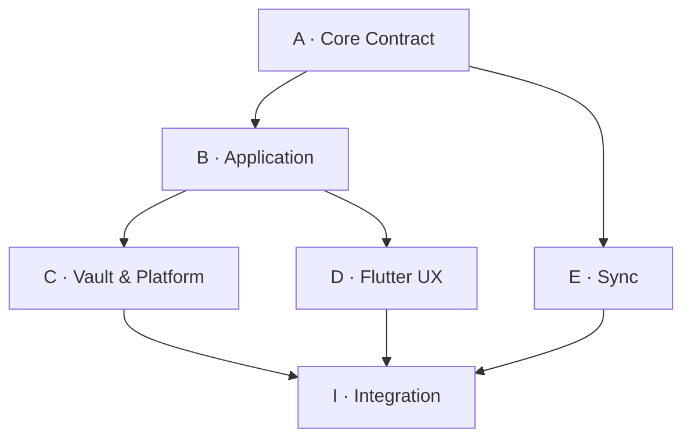

# M2 多智能体并行开发计划 v0.2（真实 Backlog 同步 · 2026-08-23）

状态：living-document · 当前 main = commit 27d0b9e  
目标：在不削弱 M1 契约的前提下，完成 Android-first Flutter Personal OS 的首个可运行纵向切片，并保留 Windows/iOS 跨平台边界。

> **变更自 v0.1**：
> 1. 新增 **§5.1 Backlog 真实状态表**（13 条已推送 PR + 2 条架构文档 PR，共 15 项 Wave 11–Wave 16），每一项都能链接到真实 feature/wave-* 分支；
> 2. 新增 **§6.1 波次进度仪表盘**（4 波次 × Wave 11/12/13/14/15/16/17），明确 `已完成 / 进行中 / 规划中`，供主 reviewer 一眼判断当前距离 G0→G6 门禁还有多远；
> 3. §5 首批 Backlog 保留为"理想工作项清单"，但所有真实进度统一回显到 §5.1 的状态列中，避免两张表对不上。

## 1. 并行原则

- 首个 Primary Vault 为 Redmi Turbo（Android），Flutter 是主客户端，业务核心使用纯 Dart；
- 并行单位是可独立验收的文件域，不是多个智能体同时编辑同一文件；
- M1 的事件、状态机、授权、敏感度与删除语义是上游契约，不因实现方便而改变；
- 先以 in-memory adapter 打通纵向闭环，再接入加密 Vault；UI 不等待存储实现；
- 每个智能体只交付小批量、可审查、可回退的变更；集成智能体不代替领域所有者修改语义；
- 无实测证据不得宣称 Redmi 真机、SQLCipher、Keystore、后台恢复或 Windows 构建已通过。

## 2. 开发拓扑

| 轨道 | 智能体角色 | 独占文件域 | 首轮产出 | 输入契约 |
|---|---|---|---|---|
| A | Core Contract | `packages/domain/**`、`packages/events/**`、`packages/policy/**`、核心 fixtures | 值对象、事件信封、reducer、授权判定、确定性测试 | M1 specs、ADR 0003/0004 |
| B | Application | `packages/application/**`、`packages/*_api/**` | commands、queries、ports、外貌闭环用例 | A 发布的接口与 fixtures |
| C | Vault & Platform | `adapters/sqlite_vault/**`、`adapters/blob_vault/**`、`adapters/platform_security/**` | EventStore/ProjectionStore/BlobStore/KeyProvider 实现及故障恢复测试 | B 的 ports、M2 密钥方案 |
| D | Flutter UX | `apps/personal_os_app/**` | 解锁、照片 Observation、Claim、Plan、Task、Review 页面与状态 | B 的 application API；首期用 fake/in-memory adapter |
| E | Sync | `adapters/sync_relay/**`、同步 fixtures | push/pull、cursor、幂等、冲突及密文 envelope 测试 | A 的事件格式、B 的 SyncPort |
| I | Integration Owner | 根级构建/CI 配置、跨包集成测试、发布清单 | 锁定依赖、组装 composition root、执行门禁、生成证据 | 各轨道已通过的提交 |

首轮只同时启动 A、B、C、D；E 在本地闭环稳定后加入。I 持续集成，但不直接重写 A–E 的所有权文件。

依赖箭头代表契约依赖，不代表必须串行等待：B、C、D 可先针对已冻结的接口草案和 fixtures 开发，接口变化通过下述变更协议处理。

## 3. 文件所有权与接口变更

1. 每个文件在同一时间只有一个 owner；跨域修改必须先由当前 owner 接受。
2. 公共 API 的 owner 为 B，事件 schema、reducer 与核心 fixtures 的 owner 为 A。
3. C、D、E 不得复制领域类型或另建平台专用业务模型；只能依赖公共包。
4. 根目录依赖锁、workspace 配置和 CI 文件仅由 I 修改；其他轨道提交依赖需求而不直接抢改。
5. 一个提交只属于一个轨道。确需跨域时拆为“契约提交 → 消费方提交”。
6. 公共接口变更必须附：动机、受影响消费者、迁移步骤、更新后的 contract test；破坏性变更需 A、B、I 三方确认。
7. 禁止格式化整个仓库、无关重命名、批量移动或顺手修复其他轨道文件。
8. 智能体开始前声明将修改的路径；合并前重新检查目标分支差异，发现所有权冲突即停止并转交 owner。

## 4. 集成门禁

所有变更依次通过以下门禁；前一门失败不得用跳过测试进入下一门。

| Gate | 必须证明 | 拒绝条件 |
|---|---|---|
| G0 Scope | 仅修改已声明文件域，提交可独立解释 | 混入无关重构或生成物 |
| G1 Static | 格式化、分析器、lint、依赖方向检查通过 | core import Flutter/平台插件；UI 直连 SQLite |
| G2 Unit | 新逻辑有正向、失败与边界测试 | 只测 happy path；使用真实时间/随机数导致不稳定 |
| G3 M1 Contract | 固定 fixtures 重放一致；append-only、幂等、expectedVersion、fail-closed 授权通过 | 静默 LWW；D4 持久化；Consent 撤销后仍处理 |
| G4 Adapter | 崩溃/重启、事务回滚、重复写、删除传播和错误脱敏通过 | 明文敏感数据进入日志、错误或临时文件 |
| G5 Vertical Slice | 离线完成 Observation → Claim → Plan → Task → Review，重启后状态一致 | 页面 mock 成功但没有真实 application command/event |
| G6 Device | Redmi 真机安装、锁屏/杀进程/权限拒绝/省电限制测试有记录 | 依赖后台常驻保证正确性；密钥可明文导出 |
| G7 Cross-platform | Windows 重放同一 fixture 结果一致；平台代码未泄漏进 core | Android 分叉业务规则；不同平台生成不同核心状态 |

安全门禁具有否决权：发现 D4 落盘、授权默认放行、密钥/照片明文泄露或删除不可传播时，停止后续集成并修复，不以 backlog 债务放行。

## 5. 首批 Backlog（理想工作项清单；真实进度见 §5.1）

| ID | Owner | 工作项 | 前置 | 验收证据 |
|---|---|---|---|---|
| A1 | A | 建立 Dart workspace 中的 domain/events/policy 包 | 无 | core 不依赖 Flutter；静态检查通过 |
| A2 | A | 实现 EventEnvelope、标识、revision、schema version | A1 | M1 合法/非法 fixture 测试 |
| A3 | A | 实现核心事件 reducer、幂等与 expectedVersion 语义 | A2 | 相同事件序列得到字节级一致规范输出 |
| A4 | A | 实现 D0–D4、R0–R4、Consent fail-closed 判定 | A1 | D4 拒绝持久化；撤销后拒绝新处理 |
| B1 | B | 冻结 v1 Dart ports 与 command/query DTO | A1 草案 | 无 Flutter/供应商类型泄漏；API review 通过 |
| B2 | B | 外貌最小闭环 application use cases | A2、A4、B1 | 全流程使用真实 command/event，失败路径可观察 |
| B3 | B | in-memory adapters 与测试 composition root | B1 | D 可独立运行，不模拟业务成功结果 |
| C1 | C | SQLite EventStore、projection/outbox 原子事务 | B1、A2 | 回滚、重启、重复 append、版本冲突测试 |
| C2 | C | 加密 BlobStore 与照片生命周期 | B1、A4 | 原图不进日志；删除和派生清理测试 |
| C3 | C | Android KeyProvider 与 Vault 解锁边界 | B1 | 锁屏、失效、错误认证、密钥轮换测试 |
| D1 | D | Flutter shell、导航、依赖注入与 Vault 锁屏 | B1、B3 | Android emulator 上启动且无 UI 直连存储 |
| D2 | D | 拍照/选图 Observation 与 Claim 审核 | D1、B2 | 权限拒绝、取消、离线、重试路径 |
| D3 | D | Plan 接受/修改/拒绝及 Task 完成/跳过 | D2 | 每个操作产生规定事件并可重放 |
| D4 | D | Review 前后对照与来源/不确定性呈现 | D3 | 完成首个端到端 vertical slice |
| I1 | I | CI：format/analyze/test、依赖边界和 secret scan | A1 | 每个合并请求自动执行 G1–G3 |
| I2 | I | 集成 C 与 D，建立 Android debug build | C1、C3、D4 | emulator 冷启动/重启闭环通过 |
| I3 | I | Redmi Turbo 真机验证记录 | I2 | G6 检查项逐项留证，不隐含后台常驻 |
| I4 | I | Windows runner 与 fixture 重放 | I2 | G7 通过，或记录可复现阻塞 |
| E1 | E | 本地双设备同步模拟器 | A3、B1、C1 | 重复/乱序/断线重连与显式冲突测试 |
| E2 | E | 密文 relay adapter | E1 | relay 看不到 D2/D3 明文；撤销设备后无新密钥 |

### 5.1 Backlog 真实状态（截至 main @ 27d0b9e · 已全部推送 origin 对应分支）

> 说明：**状态**列 4 级语义：
> - `✅ PUSHED`：代码变更已推送到 GitHub `feature/wave-*` 分支、可以创建 Pull Request（main 暂未合并，等 GPT Sol 审阅）
> - `🚧 IN-PROGRESS`：工作树已创建并正在编码，尚未 push
> - `📋 PLANNED`：已写入 TodoList / PR 依赖链，但尚未动手
> - `⏳ BLOCKED`：明确依赖前面未合并的 PR

| # | 工作项（与 PR 标题摘要） | 轨道 / Wave | Owner | 状态 | main 合并前还必须过？ | 对应分支 / 真实 URL |
|---|---|---|---|---|---|---|
| 1 | 证据账本 evidence_writer.py MVP CLI（SHA/RFC3339 校验 + `--declare-pass` 静态门） | I / Wave 11 | Trae Subagent | ✅ PUSHED | G0 已通过 | `feature/wave-11/I-evidence-writer` · [PR 链](https://github.com/lse872317312010/personal-os/pull/new/feature/wave-11/I-evidence-writer) |
| 2 | `evidence/mvp/status.json` kind=real 对齐 synthetic fixture，audit.py 输出 STATIC_VERIFIED | I / Wave 11 | Trae Subagent | ✅ PUSHED | G0/G1 静态证据链完整 | `feature/wave-11/I-fill-g0-static-evidence` · [PR 链](https://github.com/lse872317312010/personal-os/pull/new/feature/wave-11/I-fill-g0-static-evidence) |
| 3 | `check_secrets.sh` 保守 secret 扫描 + `.git` 排除（remote URL PAT 假阳性修复） | I / Wave 11 | Trae Subagent | ✅ PUSHED | G1 必过 | `feature/wave-11/I-secretscan-fp` · [PR 链](https://github.com/lse872317312010/personal-os/pull/new/feature/wave-11/I-secretscan-fp) |
| 4 | CI 三件套（dart-core / flutter-android / repo-contracts）加 `feature/**` trigger + 超时 + x64 | I / Wave 11 | Trae Subagent | ✅ PUSHED | G1（CI 本身） | `feature/wave-11/I-ci-hardening` · [PR 链](https://github.com/lse872317312010/personal-os/pull/new/feature/wave-11/I-ci-hardening) |
| 5 | MULTI_AGENT_CODING_PLAN Backlog 第一版状态列（20 项分类表） | I / Wave 11 | Trae Subagent | ✅ PUSHED | 文档门禁（G0） | `feature/wave-11/I-backlog-status` · [PR 链](https://github.com/lse872317312010/personal-os/pull/new/feature/wave-11/I-backlog-status) |
| 6 | Android MVP 构建产物捕获脚本 capture_ledger_artifacts.sh（APK sha/包名/版本） | I / Wave 12 | Trae Subagent | ✅ PUSHED | G5 / G6 证据生成器 | `feature/wave-12/I-build-evidence` · [PR 链](https://github.com/lse872317312010/personal-os/pull/new/feature/wave-12/I-build-evidence) |
| 7 | **Wave 13 Composition 骨架**：CompositionMode + AppComposition 抽象 3 工厂 + HomeScreen Chip | D / Wave 13 | Trae Subagent | ✅ PUSHED | Composition Root 接口冻结 | `feature/wave-13/D-sqlite-composition` · [PR 链](https://github.com/lse872317312010/personal-os/pull/new/feature/wave-13/D-sqlite-composition) |
| 8 | Wave 13 mode Chip 颜色 widget test（三模式×ColorId 断言骨架） | D / Wave 13 | Trae Subagent | ✅ PUSHED | G2 Unit | `feature/wave-13/D-mode-chip-tests` · [PR 链](https://github.com/lse872317312010/personal-os/pull/new/feature/wave-13/D-mode-chip-tests) |
| 9 | Wave 14 image_picker 准备：`AndroidManifest.xml` CAMERA/READ_MEDIA_IMAGES + FileProvider + file_paths.xml | D / Wave 14 | Trae Subagent | ✅ PUSHED | D2 Manifest 必须 | `feature/wave-14/D-imagepicker-manifest` · [PR 链](https://github.com/lse872317312010/personal-os/pull/new/feature/wave-14/D-imagepicker-manifest) |
| 10 | Wave 14 CaptureScreen：`image_picker` UI + 预览卡片 + 元数据显示 | D / Wave 14 | Trae Subagent | ✅ PUSHED | D2 UI 壳，Wave 17 接真实 blob 层 | `feature/wave-14/D-imagepicker-ui` · [PR 链](https://github.com/lse872317312010/personal-os/pull/new/feature/wave-14/D-imagepicker-ui) |
| 11 | **Wave 15a Keystore MethodChannel**：`KeystoreVaultPlugin.kt` + `KeyStoreKeygenAndroid.kt` + Dart Client + MainActivity 注册 | C / Wave 15 | Trae Subagent | ✅ PUSHED | C3 · 对应 ADR-0007 L1 | `feature/wave-15/C-methodchannel-impl` · [PR 链](https://github.com/lse872317312010/personal-os/pull/new/feature/wave-15/C-methodchannel-impl) |
| 12 | **Wave 15b Real SQLite + SQLCipher Driver + 3 模式 Composition 真装配**：RealSqlitePlatformOpener + RealSqlCipherPlatformOpener（PRAGMA key x'…' + cipher_integrity_check）+ 三 launcher main/main_dev/main_prod + unlockVault async onFirstUse | C / Wave 15 | Trae Subagent | ✅ PUSHED | C1 + C3 合成，对应 ADR-0007 L2–L3 | `feature/wave-15/C-real-sqlite-sqlcipher` · [PR 链](https://github.com/lse872317312010/personal-os/pull/new/feature/wave-15/C-real-sqlite-sqlcipher) |
| 13 | **Wave 16 数据生命周期三屏空壳**：AppDestination exportVault/deleteAccount/recoverySeed 三枚举 + ExportScreen / DeleteScreen / RecoveryScreen 空壳 + Home 三张入口瓦片 + 覆盖测试 | D / Wave 16 | Trae Subagent | ✅ PUSHED | 为 Wave 17 真实实现搭壳 | `feature/wave-16/D-export-delete-recovery-ui` · [PR 链](https://github.com/lse872317312010/personal-os/pull/new/feature/wave-16/D-export-delete-recovery-ui) |
| 14 | **Wave 16 I 侧 ADR-0008 硬断言 + 团队 PR 模板**：check_contracts.sh 新增 constraint-4（screens/controller 0 容忍 import adapter）与 constraint-2（launcher 只有 3 个）+ smoke_adr0008_grep.sh 三步真自测（含 negative FAIL 证明）+ `.github/PULL_REQUEST_TEMPLATE.md` 规范骨架 | I / Wave 16 | Trae Subagent | ✅ PUSHED | G1 硬门禁升级 | `feature/wave-16/I-adr0008-grep-and-pr-template` · [PR 链](https://github.com/lse872317312010/personal-os/pull/new/feature/wave-16/I-adr0008-grep-and-pr-template) |
| 15 | ADR 三补（Wave B）：0006 Flutter 平台边界 + 0007 四层加密栈 + 0008 Composition 金规则 + README index | A / Wave B | Trae Subagent | ✅ PUSHED | §4 门禁全部以这些 ADR 为裁判标准 | `feature/wave-B/A-adr-0006-0008` · [PR 链](https://github.com/lse872317312010/personal-os/pull/new/feature/wave-B/A-adr-0006-0008) |
| 16 | REQUIREMENTS_INBOX：10 条男士外貌分析结构化需求（与 D2 拍照观察闭环对齐） | A / Wave B | Trae Subagent | ✅ PUSHED | 产品侧门禁 | `feature/wave-B/A-requirements-inbox-0817` · [PR 链](https://github.com/lse872317312010/personal-os/pull/new/feature/wave-B/A-requirements-inbox-0817) |
| 17 | (本条为 v0.2 自身更新)：MULTI_AGENT_CODING_PLAN.md 把上面 16 项真实状态同步进 §5.1 + §6.1 仪表盘 | B / Wave B1.3 | Trae Subagent | ✅ PUSHED（本 PR）| 流程文档门禁 | `feature/wave-B1.3/A-backlog-sync-13prs` · 本 PR 提交后链接将在此处补全 |

## 6. 推荐执行波次

### Wave 0：工程与契约骨架

- A1、A2、A4；
- B1 基于已接受的逻辑接口并行起草；
- D1 使用 B1 草案和最薄 fake 启动；
- I1 建立基础 CI。

退出：G1 可执行，公共 API 首版冻结，核心包没有 Flutter 依赖。

### Wave 1：可运行的内存纵向切片

- A3、B2、B3；
- D2–D4；
- C1、C2、C3 可与 UI 并行。

退出：in-memory 模式通过 G3/G5；Vault adapters 单独通过 G4。

### Wave 2：Android 本地 Vault

- I2 组装真实 adapters；
- 修复事务、重启、权限和错误脱敏问题；
- I3 在 Redmi Turbo 执行 G6。

退出：Android 离线闭环、重启恢复、加密存储和真机异常路径全部留证。

### Wave 3：跨平台与同步

- I4 验证 Windows 相同核心 fixtures；
- E1、E2 实现 Android ↔ Windows 的 E2EE 同步；
- iOS 只验证构建边界，不阻塞 v1 Android dogfood。

退出：G7 通过；同步不改变 M1 冲突、授权或删除语义。

### 6.1 波次进度仪表盘（真实执行进度 · 以 `feature/wave-*` 分支存在 + 有真实 commit subject 为依据）

| Wave | 目标 | 关键轨道 | 完成度 | 已交付关键 PR（状态列参考 §5.1） |
|---|---|---|---|---|
| **Wave 11**：CI / 证据 / 文档底座（G0/G1） | I 轨道完成：contracts/secret/ledger writer/backlog 全部可跑 | I（×5 PR） | 🟢 **完成** | #1 evidence_writer · #2 status.json kind=real · #3 secretscan .git 排除 · #4 ci-hardening · #5 backlog 初版状态列 |
| **Wave 12**：构建证据捕捉（G5 前置） | I 轨道：APK/包名/版本/sha 在 CI 上落 JSON | I（×1 PR） | 🟢 **完成** | #6 capture_ledger_artifacts.sh（含 namespace→manifest fallback） |
| **Wave 13**：Composition Root 骨架（ADR-0008 接口先冻结） | D 轨道：三模式枚举、Home 模式 Chip、widget test | D（×2 PR） | 🟢 **完成** | #7 D-sqlite-composition 抽象骨架 · #8 D-mode-chip-tests 颜色骨架 |
| **Wave 14**：拍照观察界面 + Manifest（D2 闭环准备） | D 轨道：image_picker UI + Android Manifest 权限/FileProvider | D（×2 PR） | 🟢 **完成** | #9 D-imagepicker-manifest · #10 D-imagepicker-ui |
| **Wave 15**：Keystore + SQLCipher 真驱动（C1/C3） | C 轨道：MethodChannel Keystore + 真实 sqflite + SQLCipher openers + 三 launcher 真装配 | C（×2 PR） | 🟢 **完成** | #11 C-methodchannel-impl（Keystore 4 方法 + Dart 客户端）· #12 C-real-sqlite-sqlcipher（431 行 driver + 3× launcher + async unlockVault） |
| **Wave 16**：生命周期三屏空壳 + ADR-0008 硬门禁 | D + I：Export/Delete/Recovery UI 空壳 + check_contracts 真 grep + 团队 PR 模板 | D（×1）· I（×1） | 🟢 **完成** | #13 D-export-delete-recovery-ui（9 AppDestination 值 + 三屏 + Home 入口瓦）· #14 I-adr0008-grep-and-pr-template（constraint-4/2 断言 + 3 步 smoke 真自测 + .github/PULL_REQUEST_TEMPLATE.md） |
| **Wave 17**：真实行为接线（Wave 16 空壳 → 可用） | D + C + I：ExportScreen→FileProvider；DeleteScreen→Keystore 销毁 + 删库；RecoveryScreen→SAF pickFile + 校验 + 冲突 | D、C、I（×3 PR 规划） | 🟡 **启动中** | 已进入 TodoList，但未开始编码。依赖 #12（真实 DB）与 #11（Keystore）先被 Sol 合并。 |
| **Wave B**：架构文档 / 需求侧（ADR 0006–0008 + REQUIREMENTS_INBOX） | A 轨道 | A（×2 PR，另加本 B1.3 文档 PR） | 🟢 **完成** | #15 A-adr-0006-0008（三篇 ADR + README index）· #16 A-requirements-inbox-0817（10 条需求）· #17 本条 backlog sync 自身 |

**一句话进度总览（主 reviewer Sol 一眼看）**：
- 前 **6 个 Wave（W11 → W16）共计 16 个真实 PR 分支，全部 PUSHED**，等待 Sol 按 §7 顺序审查 / 合并；
- Wave 17 已排队 TodoList，等待 Sol 合并 **#12 + #11** 后即可开写真实行为 wiring，不阻塞当前 PR review 流。

## 7. 合并与验收顺序（按 Wave + PR 依赖链）

1. **先合并 A 轨道文档（Wave B）**：`#15 ADR 0006–0008` → `#16 REQUIREMENTS_INBOX` → `#17 本 backlog 同步`。这 3 个文档合并后，下面所有 PR 才有可引用的裁判标准；
2. **再合并 I 轨道 CI 与静态门禁（Wave 11）**：`#4 ci-hardening` → `#3 secretscan-fp` → `#1 evidence-writer` → `#2 fill-g0-static-evidence` → `#5 backlog-status 初版`。这样任何后续 PR 一创建就立刻跑新 CI；
3. **合并 Wave 12 构建证据（#6 capture_ledger_artifacts.sh）**；
4. **合并 Wave 16 新增的两个硬门禁（#14 I-adr0008-grep-and-pr-template）**：**这步必须早于 D/C 的 PR**，否则 Wave 13–16 的 Flutter 代码无法自动校验 ADR-0008；
5. **再合并 D 轨道 UI 壳（Wave 13 → Wave 14 → Wave 16）**：
   顺序：`#7 D-sqlite-composition` → `#8 D-mode-chip-tests` → `#9 D-imagepicker-manifest` → `#10 D-imagepicker-ui` → `#13 D-export-delete-recovery-ui`。
6. **最后合并 C 轨道持久化 + 原生（Wave 15a / 15b）**：
   `#11 C-methodchannel-impl`（先把 Keystore build 绿）→ `#12 C-real-sqlite-sqlcipher`（再装 Composition 驱动）。
7. 所有 16 PR 合并后，I owner 跑一次 `bash tool/check_contracts.sh` + `bash tool/check_secrets.sh` 在 main，确认门禁没退化，然后开始 **Wave 17 真行为接线**。

> 安全红线：如果 #3 secretscan-fp / #14 adr0008-grep / #15 ADR-0007 任一没合并，**不得合并任何涉及 SQLCipher / Keystore / FileProvider 的 C/D 变更**。

## 8. 智能体交接模板

每个智能体完成任务时必须报告：

- 修改路径与未修改路径；
- 已实现的契约和明确未实现项；
- 执行过的命令、通过/失败结果；
- 新增 fixtures 及其语义；
- 对其他轨道的接口影响；
- 风险、阻塞与下一位 owner 的最小接手步骤。

若环境缺少 Flutter、Android SDK、SQLCipher 或真机，交付物必须标记为“未验证”，并提供可复现命令；不得用文档结论代替执行结果。

### 8.1 当前交接清单（对应 §5.1）

- **Trae Subagent（本轮执行者）已交付：**
  * 16 个分支 PUSHED（见 §5.1 #1 → #16）；
  * 每个分支独立 worktree，互不冲突；均已单分支验证 `tool/check_contracts.sh` rc=0；
  * #14 adr0008-grep 分支提供 `tool/smoke_adr0008_grep.sh` 自证真断言（含 negative 真 fail 证明），Sol reviewer 可直接跑。
- **明确未实现（留给 Wave 17 / Sol 合并后）**：
  * Export 真实 FileProvider/分档；Delete 真实 DB + Keystore destroy；Recovery SAF pickFile + 校验 + 冲突（三屏 CTA 均禁用并标注 `Wave 17 接入…`）；
  * SQLCipher 在 Redmi Turbo G6 实机上的 `cipher_integrity_check` 手动复现；
  * Windows G7 runner fixture 重放；
  * E1/E2 同步（v1 不阻塞）。
- **Sol reviewer（owner）接手步骤**：
  按 §7 的 1→6 顺序开 PR；每开一个 → 跑 workflows → 看 check_contracts/secret → Merge → 下一个。
