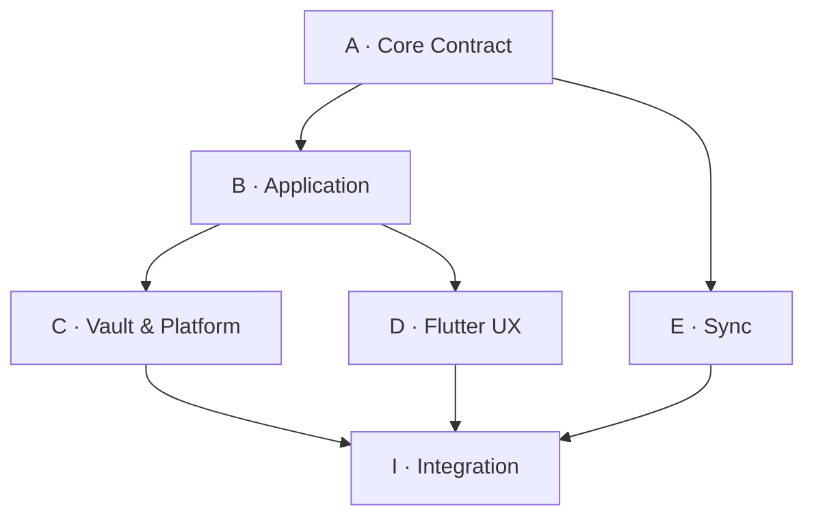

# M2 多智能体并行开发计划 v0.1

状态：proposed for execution  
目标：在不削弱 M1 契约的前提下，完成 Android-first Flutter Personal OS 的首个可运行纵向切片，并保留 Windows/iOS 跨平台边界。

## 1. 并行原则

- 首个 Primary Vault 为 Redmi Turbo（Android），Flutter 是主客户端，业务核心使用纯 Dart；
- 并行单位是可独立验收的文件域，不是多个智能体同时编辑同一文件；
- M1 的事件、状态机、授权、敏感度与删除语义是上游契约，不因实现方便而改变；
- 先以 in-memory adapter 打通纵向闭环，再接入加密 Vault；UI 不等待存储实现；
- 每个智能体只交付小批量、可审查、可回退的变更；集成智能体不代替领域所有者修改语义；
- 无实测证据不得宣称 Redmi 真机、SQLCipher、Keystore、后台恢复或 Windows 构建已通过。

## 2. 开发拓扑

| 轨道 | 智能体角色 | 独占文件域 | 首轮产出 | 输入契约 |
|---|---|---|---|---|
| A | Core Contract | `packages/domain/**`、`packages/events/**`、`packages/policy/**`、核心 fixtures | 值对象、事件信封、reducer、授权判定、确定性测试 | M1 specs、ADR 0003/0004 |
| B | Application | `packages/application/**`、`packages/*_api/**` | commands、queries、ports、外貌闭环用例 | A 发布的接口与 fixtures |
| C | Vault & Platform | `adapters/sqlite_vault/**`、`adapters/blob_vault/**`、`adapters/platform_security/**` | EventStore/ProjectionStore/BlobStore/KeyProvider 实现及故障恢复测试 | B 的 ports、M2 密钥方案 |
| D | Flutter UX | `apps/personal_os_app/**` | 解锁、照片 Observation、Claim、Plan、Task、Review 页面与状态 | B 的 application API；首期用 fake/in-memory adapter |
| E | Sync | `adapters/sync_relay/**`、同步 fixtures | push/pull、cursor、幂等、冲突及密文 envelope 测试 | A 的事件格式、B 的 SyncPort |
| I | Integration Owner | 根级构建/CI 配置、跨包集成测试、发布清单 | 锁定依赖、组装 composition root、执行门禁、生成证据 | 各轨道已通过的提交 |

首轮只同时启动 A、B、C、D；E 在本地闭环稳定后加入。I 持续集成，但不直接重写 A–E 的所有权文件。

依赖箭头代表契约依赖，不代表必须串行等待：B、C、D 可先针对已冻结的接口草案和 fixtures 开发，接口变化通过下述变更协议处理。

## 3. 文件所有权与接口变更

1. 每个文件在同一时间只有一个 owner；跨域修改必须先由当前 owner 接受。
2. 公共 API 的 owner 为 B，事件 schema、reducer 与核心 fixtures 的 owner 为 A。
3. C、D、E 不得复制领域类型或另建平台专用业务模型；只能依赖公共包。
4. 根目录依赖锁、workspace 配置和 CI 文件仅由 I 修改；其他轨道提交依赖需求而不直接抢改。
5. 一个提交只属于一个轨道。确需跨域时拆为“契约提交 → 消费方提交”。
6. 公共接口变更必须附：动机、受影响消费者、迁移步骤、更新后的 contract test；破坏性变更需 A、B、I 三方确认。
7. 禁止格式化整个仓库、无关重命名、批量移动或顺手修复其他轨道文件。
8. 智能体开始前声明将修改的路径；合并前重新检查目标分支差异，发现所有权冲突即停止并转交 owner。

## 4. 集成门禁

所有变更依次通过以下门禁；前一门失败不得用跳过测试进入下一门。

| Gate | 必须证明 | 拒绝条件 |
|---|---|---|
| G0 Scope | 仅修改已声明文件域，提交可独立解释 | 混入无关重构或生成物 |
| G1 Static | 格式化、分析器、lint、依赖方向检查通过 | core import Flutter/平台插件；UI 直连 SQLite |
| G2 Unit | 新逻辑有正向、失败与边界测试 | 只测 happy path；使用真实时间/随机数导致不稳定 |
| G3 M1 Contract | 固定 fixtures 重放一致；append-only、幂等、expectedVersion、fail-closed 授权通过 | 静默 LWW；D4 持久化；Consent 撤销后仍处理 |
| G4 Adapter | 崩溃/重启、事务回滚、重复写、删除传播和错误脱敏通过 | 明文敏感数据进入日志、错误或临时文件 |
| G5 Vertical Slice | 离线完成 Observation → Claim → Plan → Task → Review，重启后状态一致 | 页面 mock 成功但没有真实 application command/event |
| G6 Device | Redmi 真机安装、锁屏/杀进程/权限拒绝/省电限制测试有记录 | 依赖后台常驻保证正确性；密钥可明文导出 |
| G7 Cross-platform | Windows 重放同一 fixture 结果一致；平台代码未泄漏进 core | Android 分叉业务规则；不同平台生成不同核心状态 |

安全门禁具有否决权：发现 D4 落盘、授权默认放行、密钥/照片明文泄露或删除不可传播时，停止后续集成并修复，不以 backlog 债务放行。

## 5. 首批 Backlog

| ID | Owner | 工作项 | 前置 | 验收证据 |
|---|---|---|---|---|
| A1 | A | 建立 Dart workspace 中的 domain/events/policy 包 | 无 | core 不依赖 Flutter；静态检查通过 |
| A2 | A | 实现 EventEnvelope、标识、revision、schema version | A1 | M1 合法/非法 fixture 测试 |
| A3 | A | 实现核心事件 reducer、幂等与 expectedVersion 语义 | A2 | 相同事件序列得到字节级一致规范输出 |
| A4 | A | 实现 D0–D4、R0–R4、Consent fail-closed 判定 | A1 | D4 拒绝持久化；撤销后拒绝新处理 |
| B1 | B | 冻结 v1 Dart ports 与 command/query DTO | A1 草案 | 无 Flutter/供应商类型泄漏；API review 通过 |
| B2 | B | 外貌最小闭环 application use cases | A2、A4、B1 | 全流程使用真实 command/event，失败路径可观察 |
| B3 | B | in-memory adapters 与测试 composition root | B1 | D 可独立运行，不模拟业务成功结果 |
| C1 | C | SQLite EventStore、projection/outbox 原子事务 | B1、A2 | 回滚、重启、重复 append、版本冲突测试 |
| C2 | C | 加密 BlobStore 与照片生命周期 | B1、A4 | 原图不进日志；删除和派生清理测试 |
| C3 | C | Android KeyProvider 与 Vault 解锁边界 | B1 | 锁屏、失效、错误认证、密钥轮换测试 |
| D1 | D | Flutter shell、导航、依赖注入与 Vault 锁屏 | B1、B3 | Android emulator 上启动且无 UI 直连存储 |
| D2 | D | 拍照/选图 Observation 与 Claim 审核 | D1、B2 | 权限拒绝、取消、离线、重试路径 |
| D3 | D | Plan 接受/修改/拒绝及 Task 完成/跳过 | D2 | 每个操作产生规定事件并可重放 |
| D4 | D | Review 前后对照与来源/不确定性呈现 | D3 | 完成首个端到端 vertical slice |
| I1 | I | CI：format/analyze/test、依赖边界和 secret scan | A1 | 每个合并请求自动执行 G1–G3 |
| I2 | I | 集成 C 与 D，建立 Android debug build | C1、C3、D4 | emulator 冷启动/重启闭环通过 |
| I3 | I | Redmi Turbo 真机验证记录 | I2 | G6 检查项逐项留证，不隐含后台常驻 |
| I4 | I | Windows runner 与 fixture 重放 | I2 | G7 通过，或记录可复现阻塞 |
| E1 | E | 本地双设备同步模拟器 | A3、B1、C1 | 重复/乱序/断线重连与显式冲突测试 |
| E2 | E | 密文 relay adapter | E1 | relay 看不到 D2/D3 明文；撤销设备后无新密钥 |

## 6. 推荐执行波次

### Wave 0：工程与契约骨架

- A1、A2、A4；
- B1 基于已接受的逻辑接口并行起草；
- D1 使用 B1 草案和最薄 fake 启动；
- I1 建立基础 CI。

退出：G1 可执行，公共 API 首版冻结，核心包没有 Flutter 依赖。

### Wave 1：可运行的内存纵向切片

- A3、B2、B3；
- D2–D4；
- C1、C2、C3 可与 UI 并行。

退出：in-memory 模式通过 G3/G5；Vault adapters 单独通过 G4。

### Wave 2：Android 本地 Vault

- I2 组装真实 adapters；
- 修复事务、重启、权限和错误脱敏问题；
- I3 在 Redmi Turbo 执行 G6。

退出：Android 离线闭环、重启恢复、加密存储和真机异常路径全部留证。

### Wave 3：跨平台与同步

- I4 验证 Windows 相同核心 fixtures；
- E1、E2 实现 Android ↔ Windows 的 E2EE 同步；
- iOS 只验证构建边界，不阻塞 v1 Android dogfood。

退出：G7 通过；同步不改变 M1 冲突、授权或删除语义。

## 7. 合并与验收顺序

1. 合并 A 的最小核心类型与 fixtures；
2. 合并 B 的 ports，再合并 B 的 use cases；
3. 合并 D 的 in-memory vertical slice，证明交互与业务闭环；
4. 分别合并 C 的 Vault、Blob、KeyProvider adapters；
5. 由 I 组装真实 Android composition root，执行 G0–G5；
6. 完成 Redmi Turbo G6 后，Android dogfood build 才可标记 ready；
7. 合并 Windows fixture 验证，再开始 E 的同步集成；
8. G7 和同步安全测试通过后，提交 M2 退出评审。

验收严格按“核心契约 → 用例 → 内存闭环 → 加密持久化 → Redmi 真机 → Windows 一致性 → 同步”进行。UI 演示、编译成功或单元测试数量均不能替代前序证据。

## 8. 智能体交接模板

每个智能体完成任务时必须报告：

- 修改路径与未修改路径；
- 已实现的契约和明确未实现项；
- 执行过的命令、通过/失败结果；
- 新增 fixtures 及其语义；
- 对其他轨道的接口影响；
- 风险、阻塞与下一位 owner 的最小接手步骤。

若环境缺少 Flutter、Android SDK、SQLCipher 或真机，交付物必须标记为“未验证”，并提供可复现命令；不得用文档结论代替执行结果。
